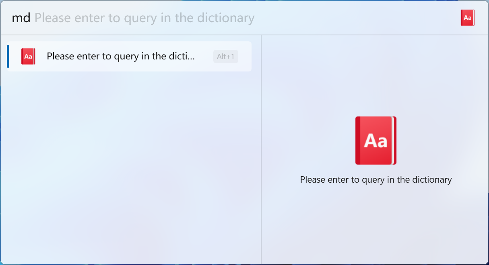
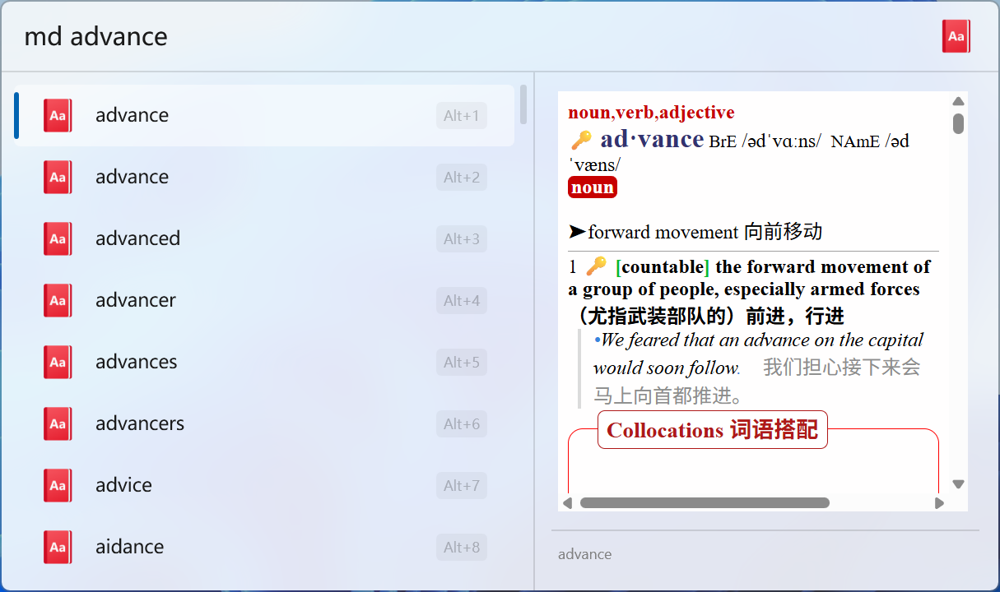

  

# Flow Launcher MDict Plugin

  
  
  
  
  

**This plugin is a MDict dictionary searcher for [Flow Launcher](https://github.com/Flow-Launcher/Flow.Launcher). It can help you search entries in MDict dictionaries.**

## ⭐ Features

- Fuzzy search entries in MDict dictionaries
- Dictionary file light / dark theme support
- Spell check support

## 🖼️ Screenshots

<picture>
  <source media="(prefers-color-scheme: dark)" srcset="./images/screenshot1_dark.png">
  <source media="(prefers-color-scheme: light)" srcset="./images/screenshot1_light.png">
  
</picture>

<picture>
  <source media="(prefers-color-scheme: dark)" srcset="./images/screenshot2_dark.png">
  <source media="(prefers-color-scheme: light)" srcset="./images/screenshot2_light.png">
  
</picture>

## 🚀 Installation

* Plugin Store (Recommended)

  1. Search `MDict` in Flow Launcher Plugin Store and install

* Manually Release

  1. Downlaod zip file from [Release](https://github.com/Jack251970/Flow.Launcher.Plugin.MDict/releases)
  2. Unzip the release zip file
  3. Place the released contents in your `%appdata%/FlowLauncher/Plugins` folder and **restart** Flow Launcher

* Manually Build

  1. Clone the repository
  2. Run `build.ps1` or `build.sh` to publish the plugin in `.dist` folder
  3. Unzip the release zip file
  4. Place the released contents in your `%appdata%/FlowLauncher/Plugins` folder and **restart** Flow Launcher

## 📝 Usage

### 0. Set Action Keyword

The default action keyword is `md`, you can change it in the Flow Launcher.

### 1.1 Setup MDict Dictionary

Firstly, open the plugin settings in Flow Launcher.

#### 1.2 Setup Dictionary File

By clicking the `Select` button in the settings, you can add MDict dictionary file.

Select the mdx file you want to use, for example, `C:\MDict\mydict.mdx`.

#### 1.3 Setup Css Files (v1.2.0+)

Add css files for light and dark theme support.
These css files should use the relative path to the folder of the dictionary file.

For example, if your dictionary file is `C:\MDict\mydict.mdx` and the css files are `C:\MDict\css\light.css` and `C:\MDict\css\dark.css`,
and then you should set the light css to `css\light.css` and dark css to `css\dark.css` in the settings.

### 2. Search MDict Dictionary

Type the action keyword `md` followed by a space and then the word you want to search in the MDict dictionary.
The plugin will use fuzzy search to find the entries in the dictionary.

## 📚 Reference

- [ICONS](https://icons8.com/icons)
- [MDict.Csharp](https://github.com/Jack251970/MDict.Csharp)
- [WindowManager](https://github.com/Jack251970/Flow.Launcher.Plugin.WindowManager)

## 📄 License

[MIT License](LICENSE)

## ❤️ Thank You

If you are enjoying this plugin, then please support my work and enthusiasm by buying me a coffee on
[https://ko-fi/jackye](https://ko-fi.com/jackye).

